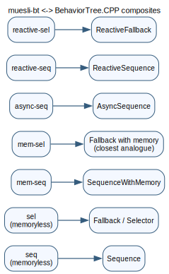
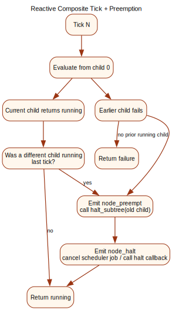

# BT.CPP Crosswalk

This page maps muesli-bt composite names to the closest BehaviorTree.CPP semantics.





## Naming Map

| muesli-bt | BehaviorTree.CPP analogue | Semantics |
| --- | --- | --- |
| `seq` | `Sequence` | memoryless sequence, restart from child 0 each tick |
| `sel` | `Fallback`/`Selector` | memoryless fallback, restart from child 0 each tick |
| `mem-seq` | `SequenceWithMemory` | resume from the last running/failing child |
| `mem-sel` | fallback-with-memory | resume from last running child; skip earlier failed children |
| `async-seq` | `AsyncSequence` | yield `running` between child boundaries |
| `reactive-seq` | `ReactiveSequence` | re-check from child 0 each tick; pre-empt stale running work |
| `reactive-sel` | `ReactiveFallback` | re-check high priority children each tick; pre-empt lower running work |

## Porting Checklist

1. If your BT.CPP tree uses `SequenceWithMemory`, use `mem-seq`.
2. If you need fallback lock-in while a low-priority branch is running, use `mem-sel`.
3. If you rely on guard re-check + interruption, use `reactive-seq` or `reactive-sel`.
4. Put long work under `async-seq` (or async leaves like `async-sleep-ms`) so reactive parents can pre-empt quickly.
5. Ensure running leaves are haltable (scheduler-backed job id or action halt callback) when used under reactive composites.

## Practical Patterns

### Reactive guard + long action

```lisp
(reactive-seq
  (cond safety-ok)
  (async-seq
    (act prepare-step)
    (act async-sleep-ms 200)
    (act commit-step)))
```

### Recovery with locked fallback

```lisp
(mem-sel
  (seq (cond target-visible) (act approach-target) (act grasp))
  (act search-target))
```

## See Also

- [Behaviour Tree Semantics](semantics.md)
- [Behaviour Tree Syntax](syntax.md)
- [Reactive Guard Demo](../examples/reactive-guard-demo.md)
