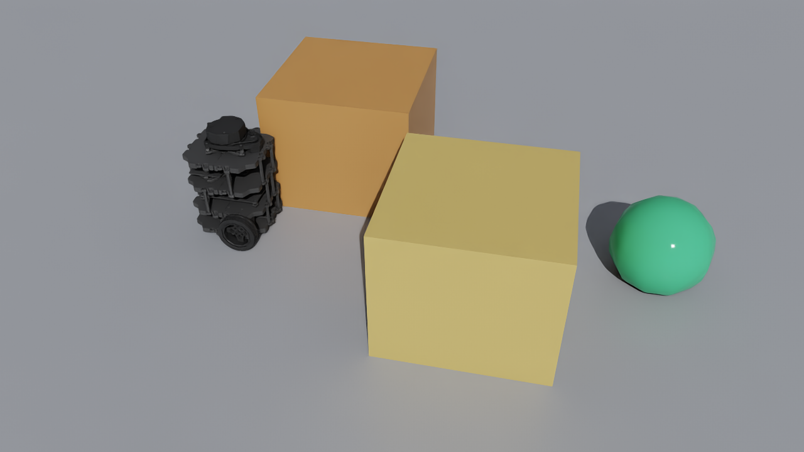

# Isaac Sim: TurtleBot3 ROS2 Demo

!!! note "status"
    Status: experimental supporting demo.
    This page documents a reproducible Isaac Sim / ROS2 showcase path. It does not expand the core runtime semantics beyond the thin ROS2 host integration boundary.

## what this is

This example shows a TurtleBot3 Burger in Isaac Sim driven through the existing ROS 2 wheeled interface.

`muesli-bt` reads `nav_msgs/msg/Odometry`, publishes `geometry_msgs/msg/Twist`, and runs the same goal-seeking behaviour used by the other wheeled examples.

The demo is designed to be easy to stage, easy to record, and easy to repeat.

### showcase media

The bundled clip and still come from a live ROS 2 run of `muesli-bt` against the Isaac scene below. The video is a short excerpt from the start of the run so the robot stays clearly visible in frame.

<video controls loop muted playsinline src="../assets/demos/isaac-turtlebot3/showcase.mp4"></video>



## when to use it

Use this example when you want to:

- run the wheeled goal-seeking demo in Isaac Sim
- keep the ROS 2 interface simple and familiar
- record a short simulator clip
- collect the same JSONL and canonical event logs as the other ROS-backed runs

## how it works

The runtime boundary is:

```text
/robot/odom     nav_msgs/msg/Odometry
/robot/cmd_vel  geometry_msgs/msg/Twist
```

Isaac Sim hosts the robot, scene, camera, and capture path.
`muesli-bt` runs the existing ROS 2 demo entrypoint:

```bash
source /opt/ros/humble/setup.bash
./build/linux-ros2/muslisp_ros2 examples/repl_scripts/ros2-flagship-goal.lisp
```

The checked-in Isaac-side contract is:

```yaml
--8<-- "examples/isaac_wheeled_ros2_demo/isaac/topic_contract.yaml"
```

The checked-in TurtleBot3 scene recipe is:

```yaml
--8<-- "examples/isaac_wheeled_ros2_demo/isaac/turtlebot3_scene_recipe.yaml"
```

The checked-in capture helper that produced the bundled clip and still is:

```text
tools/isaac_capture_helpers/run_live_ros2_tb3_capture.sh
```

On hosts where Isaac Sim and ROS 2 use different Python versions, the live helper keeps the Isaac process and the ROS 2 bridge in separate processes and connects them over localhost UDP. This keeps the public ROS 2 topic contract unchanged.

## api / syntax

### files

Key files for this demo:

- `examples/repl_scripts/ros2-flagship-goal.lisp`
- `examples/isaac_wheeled_ros2_demo/isaac/topic_contract.yaml`
- `examples/isaac_wheeled_ros2_demo/isaac/turtlebot3_scene_recipe.yaml`
- `tools/isaac_capture_helpers/run_live_ros2_tb3_capture.sh`
- `tools/isaac_capture_helpers/live_ros2_tb3_showcase.py`
- `tools/isaac_capture_helpers/ros2_udp_bridge.py`
- `tools/isaac_capture_helpers/export_tb3_showcase.py`
- `docs/assets/demos/isaac-turtlebot3/showcase.mp4`
- `docs/assets/demos/isaac-turtlebot3/scene.png`

### topic contract

Required topics:

```text
/robot/odom     nav_msgs/msg/Odometry
/robot/cmd_vel  geometry_msgs/msg/Twist
```

Useful companion topics:

```text
/tf
/clock
```

### scene layout

The intended scene is deliberately compact:

- one TurtleBot3 Burger mobile base
- one visible goal marker
- two or three fixed obstacles
- one third-person camera angle with the full route in view

This keeps the run legible in a short clip and keeps the ROS 2 setup straightforward.

## example

### run it

Build the ROS 2 runner if needed:

```bash
source /opt/ros/humble/setup.bash
cmake -S . -B build/linux-ros2 -G Ninja \
  -DCMAKE_BUILD_TYPE=Debug \
  -DMUESLI_BT_BUILD_INTEGRATION_ROS2=ON \
  -DMUESLI_BT_BUILD_INTEGRATION_PYBULLET=OFF \
  -DMUESLI_BT_BUILD_INTEGRATION_WEBOTS=OFF \
  -DMUESLI_BT_BUILD_PYTHON_BRIDGE=OFF \
  -DMUESLI_BT_BUILD_WEBOTS_EXAMPLES=OFF
cmake --build build/linux-ros2 -j
```

If you want the fully automatic live capture path, run:

```bash
export OMNI_KIT_ACCEPT_EULA=YES
bash tools/isaac_capture_helpers/run_live_ros2_tb3_capture.sh
```

This helper:

- starts `Xvfb` if needed
- starts the ROS 2 UDP bridge
- launches the live Isaac TurtleBot3 scene
- runs `examples/repl_scripts/ros2-flagship-goal.lisp`
- writes the clip, still image, and state trace

The default live outputs are:

```text
/home/deploy/isaac_tb3_live_ros2/showcase.mp4
/home/deploy/isaac_tb3_live_ros2/scene.png
/home/deploy/isaac_tb3_live_ros2/state_trace.jsonl
```

If you want to stage the scene or run each part manually, start with a virtual display on a remote Linux host:

```bash
Xvfb :88 -screen 0 1280x720x24 >/tmp/xvfb88.log 2>&1 &
export DISPLAY=:88
```

Run the bridge, scene, and BT in separate terminals:

Terminal 1:

```bash
source /opt/ros/humble/setup.bash
python3 tools/isaac_capture_helpers/ros2_udp_bridge.py
```

Terminal 2:

```bash
export OMNI_KIT_ACCEPT_EULA=YES
export DISPLAY=:88
source /home/deploy/env_isaaclab/bin/activate
python tools/isaac_capture_helpers/live_ros2_tb3_showcase.py \
  --usd-path /home/deploy/turtlebot3_imported/turtlebot3_burger/turtlebot3_burger.usda \
  --output-dir /home/deploy/isaac_tb3_live_ros2
```

Terminal 3:

```bash
source /opt/ros/humble/setup.bash
./build/linux-ros2/muslisp_ros2 examples/repl_scripts/ros2-flagship-goal.lisp
```

Then verify the bridge:

```bash
source /opt/ros/humble/setup.bash
ros2 topic list | grep -E '^/robot/(odom|cmd_vel)$'
ros2 topic echo /robot/odom --once
ros2 topic echo /tf --once
```

If you are using the checked-in Isaac Lab container helpers:

```bash
./tools/docker/isaac_lab_vla_stack/run.sh verify-isaac-wheeled-topics
./tools/docker/isaac_lab_vla_stack/run.sh isaac-sim-state play
./tools/docker/isaac_lab_vla_stack/run.sh isaac-wheeled-demo
```

### capture the bundled media

The bundled media can be reproduced with the live helper:

```bash
export OMNI_KIT_ACCEPT_EULA=YES
bash tools/isaac_capture_helpers/run_live_ros2_tb3_capture.sh
```

This writes:

- `/home/deploy/isaac_tb3_live_ros2/showcase.mp4`
- `/home/deploy/isaac_tb3_live_ros2/scene.png`
- `/home/deploy/isaac_tb3_live_ros2/frames/frame_*.png`
- `/home/deploy/isaac_tb3_live_ros2/state_trace.jsonl`

The bundled clip is a short excerpt from that live run. The helper keeps the early part of the run, where the robot, obstacles, and goal are all readable in one shot.

If you want a scripted camera-only preview without the live ROS 2 loop, use:

```bash
export OMNI_KIT_ACCEPT_EULA=YES
export DISPLAY=:88
source /home/deploy/env_isaaclab/bin/activate
python tools/isaac_capture_helpers/export_tb3_showcase.py \
  --usd-path /home/deploy/turtlebot3_imported/turtlebot3_burger/turtlebot3_burger.usda \
  --output-dir /home/deploy/isaac_tb3_showcase
```

### what to look for

- the robot should turn cleanly towards the route and make steady progress without changing the ROS 2 message surface
- `/robot/odom` should stay live throughout the run
- `/robot/cmd_vel` should reflect the active branch decisions from the BT
- the run should produce both the run-loop log and the canonical event log

### logs

The current runner writes:

```text
build/linux-ros2/ros2-flagship-goal.jsonl
build/linux-ros2/ros2-flagship-goal/events.jsonl
```

These logs can be inspected directly or normalised with:

```bash
python3 examples/flagship_wheeled/tools/normalise_run.py \
  --backend ros2 \
  --input build/linux-ros2/ros2-flagship-goal.jsonl
```

### capture it

For a clean recording:

1. Keep the camera fixed on the route, the obstacle, and the goal marker.
2. Export frames from the viewport instead of screen-recording the X display.
3. Keep the clip short enough that the robot remains easy to follow.
4. Keep the still image from the same sequence as the clip.
5. Store the media beside the matching run logs.

Recommended output set:

- `docs/assets/demos/isaac-turtlebot3/showcase.mp4`
- `docs/assets/demos/isaac-turtlebot3/scene.png`
- `build/linux-ros2/ros2-flagship-goal.jsonl`
- `build/linux-ros2/ros2-flagship-goal/events.jsonl`

Example caption:

`TurtleBot3 Burger in Isaac Sim running the shared muesli-bt wheeled demo through the ROS 2 odometry-to-twist interface.`

## gotchas

- Keep the robot namespace on `/robot` unless you are also updating the demo configuration.
- Keep the camera angle wide enough to show both the start area and the goal.
- On remote Linux hosts, viewport export is more reliable than X11 screen capture.
- If a particular Isaac build does not expose a working TurtleBot3 asset, keep the same ROS 2 contract and swap only the robot asset.
- If the scene publishes different topic names, document the remap explicitly before recording media.

## see also

- `examples/isaac_wheeled_ros2_demo/isaac/topic_contract.yaml`
- `examples/isaac_wheeled_ros2_demo/isaac/turtlebot3_scene_recipe.yaml`
- `tools/isaac_capture_helpers/export_tb3_showcase.py`
- [Isaac Sim / ROS2: H1 locomotion demo](isaac-h1-ros2-demo.md)
- [ROS2 tutorial](../integration/ros2-tutorial.md)
