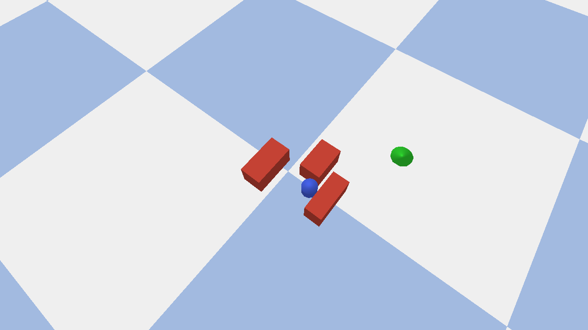

# pybullet: e-puck-style goal seeking



This example runs the shared wheeled flagship BT against a compact differential-drive surrogate in PyBullet.

The default run is deliberately simple: it reaches the goal on a clear path and gives you a quick success check for the shared BT, the Python bridge, and the JSONL log surface. The optional clutter layout adds a tighter scene that is useful for inspection and screenshots.

## what it demonstrates

- the shared wheeled flagship BT on a compact differential-drive surrogate
- a PyBullet path that keeps `[linear_x, angular_z]` visible all the way to the robot command surface
- a stricter embodiment match to the Webots e-puck family than the racecar demo provides
- JSONL logs that can be inspected alongside the existing cross-transport tooling
- a clean default scene for successful first-run verification, with an optional clutter layout for manual inspection

## run it

First run, using the clear default scene:

```bash
make demo-setup
PYTHONPATH=build/dev/python \
  .venv-py311/bin/python examples/pybullet_epuck_goal/run_demo.py --headless
```

GUI run:

```bash
PYTHONPATH=build/dev/python \
  .venv-py311/bin/python examples/pybullet_epuck_goal/run_demo.py
```

Optional clutter layout:

```bash
PYTHONPATH=build/dev/python \
  .venv-py311/bin/python examples/pybullet_epuck_goal/run_demo.py --with-default-obstacles
```

## capture a scene preview

The checked-in preview image on this page comes from the clutter layout:

```bash
PYTHONPATH=build/dev/python \
  .venv-py311/bin/python examples/pybullet_epuck_goal/run_demo.py \
  --headless \
  --with-default-obstacles \
  --camera-distance 1.25 \
  --camera-yaw 38 \
  --camera-pitch -63 \
  --screenshot-target-x 0.02 \
  --screenshot-target-y 0.02 \
  --screenshot-path docs/assets/demos/pybullet-epuck-goal/scene.png
```

## what to look for

- the flagship BT still switches between `goal_reached`, `avoid`, `planner`, and `direct_goal`
- the simulator maps shared flagship commands into differential left/right wheel motion
- the robot reaches the goal without introducing a simulator-specific BT fork
- the log keeps the branch, planner, and shared-action surfaces visible

## logs

- tick log: `examples/pybullet_epuck_goal/logs/<run_id>.jsonl`
- metadata: `examples/pybullet_epuck_goal/logs/<run_id>.run_metadata.json`
- optional scene preview: any path passed via `--screenshot-path`

## key files

- `examples/pybullet_epuck_goal/bt/flagship_entry.lisp`
- `examples/pybullet_epuck_goal/run_demo.py`

## BT source (inline)

```lisp
--8<-- "examples/pybullet_epuck_goal/bt/flagship_entry.lisp"
```

Full walkthrough:

- [PyBullet e-puck-style goal full source page](pybullet-epuck-goal-source.md)

## see also

- [Webots: e-puck Goal Seeking](webots-epuck-goal-seeking.md)
- [same-robot strict comparison track](../integration/same-robot-strict-comparison.md)
