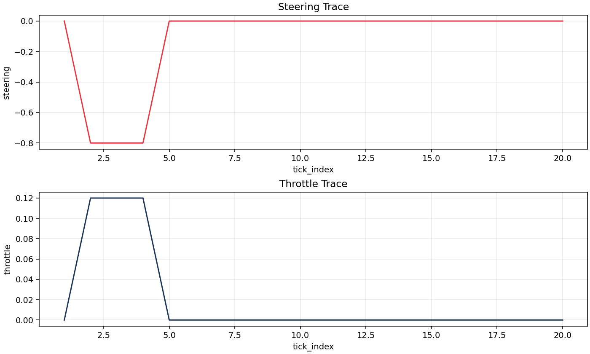

# PyBullet: Racecar


_Scene preview of the racecar environment used by the demo._



_Runtime action trace snapshot from a planner-mode run._

## What It Demonstrates

- backend-managed observe/tick/act/step loop in PyBullet
- BT safety branch + planner branch (`plan-action` -> `planner.plan`)
- structured tick logs (`racecar_demo.v1`) with planner diagnostics

## Run It

```bash
make demo-setup
make demo-run MODE=bt_planner
```

Direct command:

```bash
PYTHONPATH=build/dev/python \
  .venv-py311/bin/python examples/pybullet_racecar/run_demo.py \
  --mode bt_planner --budget-ms 20 --work-max 1200
```

## What To Look For

- budgets: planner `time_used_ms` should stay near or below configured `budget_ms`
- behaviour switching: safety branch pre-empts when collisions are predicted
- fallback: safe action path should be used when planner output is unavailable
- event logging: inspect `racecar_demo.v1` records plus canonical `mbt.evt.v1` events

## Logs And Plots

- tick log: `examples/pybullet_racecar/logs/<run_id>.jsonl`
- metadata: `examples/pybullet_racecar/logs/<run_id>.run_metadata.json`
- plot command:

```bash
.venv-py311/bin/python examples/pybullet_racecar/scripts/plot_logs.py \
  examples/pybullet_racecar/logs/<run_id>.jsonl \
  --out examples/pybullet_racecar/out/
```

## Key BT Files

- `examples/pybullet_racecar/bt/racecar_bt.lisp`
- runtime entry: `examples/pybullet_racecar/run_demo.py`

## BT Source (Inline)

```lisp
--8<-- "examples/pybullet_racecar/bt/racecar_bt.lisp"
```

Full walkthrough:

- [PyBullet racecar full source page](pybullet-racecar-source.md)

## Render BT DOT

```bash
.venv-py311/bin/python examples/pybullet_racecar/scripts/render_bt_dot.py \
  --out examples/pybullet_racecar/out/bt.svg
```
