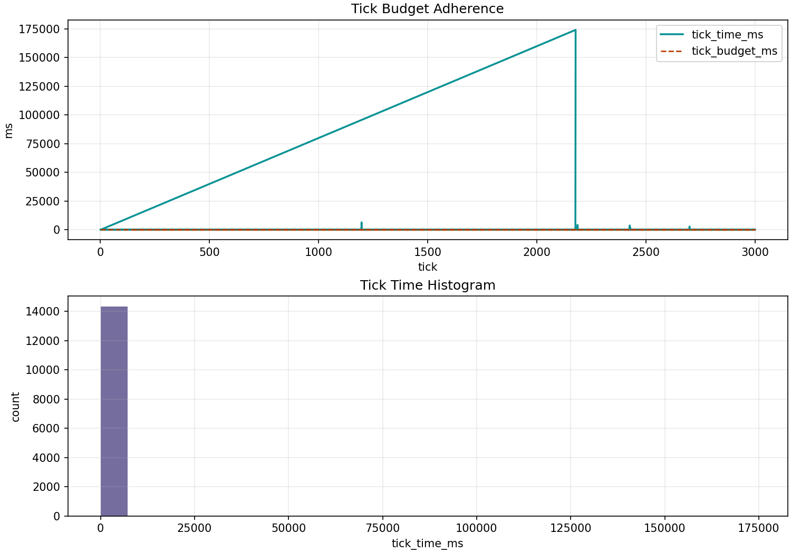

# Webots: e-puck Line Following


_Scene preview from the line-follow world and initial e-puck pose._



_Runtime budget snapshot from a recorded line-follow run._

## What It Demonstrates

- line reacquisition and line-follow branch logic in BT language
- planner-assisted follow branch with confidence/top-k diagnostics
- observation mapping (`line_error`, `ground`, `proximity`) into behaviour decisions

## Run It

Build controller target:

```bash
cmake --preset dev -DMUESLI_BT_BUILD_WEBOTS_EXAMPLES=ON
cmake --build --preset dev --parallel --target muesli_webots_epuck_line
```

Run world:

```bash
"$WEBOTS_HOME/webots" --batch --mode=fast --stdout --stderr \
  examples/webots_epuck_line/worlds/epuck_line_follow.wbt
```

## What To Look For

- budgets: `budget.tick_time_ms` should track configured tick budget
- behaviour switching: branch should move between search and follow paths as line confidence changes
- fallback: search branch should keep motion safe when line signal is weak
- event logging: verify BT active path and planner metadata in JSONL logs

## Logs And Plots

- log file: `examples/webots_epuck_line/logs/line.jsonl`
- planner/signal plots:

```bash
.venv-py311/bin/python examples/_tools/plot_planner_root.py \
  examples/webots_epuck_line/logs/line.jsonl \
  --every 40 --k 5 \
  --out_dir examples/webots_epuck_line/out
```

## Key BT Files

- `examples/webots_epuck_line/lisp/main.lisp`
- `examples/webots_epuck_line/lisp/bt_line_follow.lisp`

## BT Source (Inline)

```lisp
--8<-- "examples/webots_epuck_line/lisp/bt_line_follow.lisp"
```

Full source and walkthrough:

- [Webots e-puck line full source page](webots-epuck-line-following-source.md)

## Render BT DOT

`main.lisp` exports `out/tree.dot` at startup.

```bash
dot -Tsvg examples/webots_epuck_line/out/tree.dot \
  -o examples/webots_epuck_line/out/tree.svg
```
