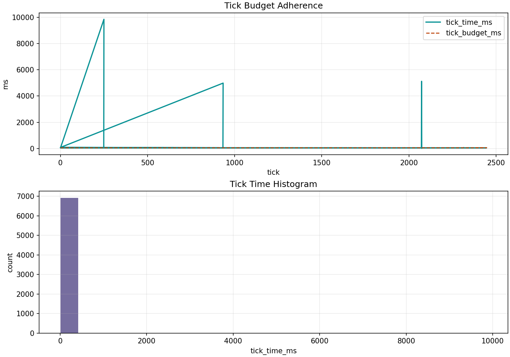

# Webots: e-puck Obstacle Avoidance + Wall Following


_Scene preview from the obstacle arena world and initial e-puck pose._



_Runtime budget snapshot from a recorded obstacle run._

## What It Demonstrates

- BT branch switching between roam, wall-follow, and collision-avoid modes
- backend observation mapping from e-puck proximity sensors
- bounded tick budget logging in a simulator loop

## Run It

Build controller target:

```bash
cmake --preset dev -DMUESLI_BT_BUILD_WEBOTS_EXAMPLES=ON
cmake --build --preset dev --parallel --target muesli_webots_epuck_obstacle
```

Run world:

```bash
"$WEBOTS_HOME/webots" --batch --mode=fast --stdout --stderr \
  examples/webots_epuck_obstacle/worlds/epuck_obstacle_arena.wbt
```

## What To Look For

- budgets: watch `budget.tick_time_ms` against `budget.tick_budget_ms`
- behaviour switching: BT should move across roam, wall-follow, and avoid branches
- fallback: safety branch should win when front proximity rises
- event logging: confirm active path and action outputs in JSONL records

## Logs And Plots

- log file: `examples/webots_epuck_obstacle/logs/obstacle.jsonl`
- plot timeline:

```bash
.venv-py311/bin/python examples/_tools/plot_bt_timeline.py \
  examples/webots_epuck_obstacle/logs/obstacle.jsonl \
  --out examples/webots_epuck_obstacle/out/bt_timeline.png
```

## Key BT Files

- `examples/webots_epuck_obstacle/lisp/main.lisp`
- `examples/webots_epuck_obstacle/lisp/bt_obstacle_wallfollow.lisp`

## BT Source (Inline)

```lisp
--8<-- "examples/webots_epuck_obstacle/lisp/bt_obstacle_wallfollow.lisp"
```

Full source and walkthrough:

- [Webots e-puck obstacle full source page](webots-epuck-obstacle-wall-following-source.md)

## Render BT DOT

`main.lisp` exports `out/tree.dot` at startup.

```bash
dot -Tsvg examples/webots_epuck_obstacle/out/tree.dot \
  -o examples/webots_epuck_obstacle/out/tree.svg
```
