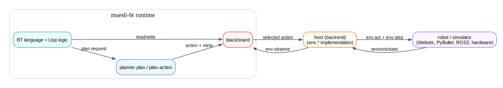

# What Is muesli-bt

muesli-bt is a compact Lisp runtime plus behaviour-tree runtime for robotics and control systems.

It gives you a Lisp-first way to write task logic while keeping control over runtime details such as tick cadence, deadlines, fallback actions, and structured logs.

Typical usage pattern:

1. write BT language logic and helper Lisp code
2. connect to a [host](../terminology.md#host) (backend) that implements `env.*`
3. run a tick loop (`observe -> tick -> act -> step`) in simulation or on a robot
4. inspect logs/traces and iterate quickly

## Architecture At A Glance

The backend owns platform integration (Webots/PyBullet/ROS2/hardware), while Lisp + BT code owns task logic.

## Why This Split Helps

- scripts stay focused on behaviour and decision logic
- backend code stays focused on sensors/actuators/timing
- schemas keep data contracts explicit (`observation`, `action`, `log`)
- budgets keep loops responsive under load

## See Also

- [How Execution Works](how-execution-works.md)
- [Integration Overview](../integration/overview.md)
- [Examples Overview](../examples/index.md)
- [Terminology](../terminology.md)
