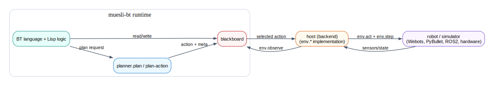

# What Is muesli-bt

muesli-bt is a compact Lisp runtime plus behaviour-tree runtime for robotics and control systems.

It gives you a Lisp-first way to write task logic while keeping control over runtime details such as tick cadence, deadlines, fallback actions, and structured logs.

Start with this page if you want the shortest orientation before building or reading examples.

## Who This Is For

This project is aimed at robotics, AI, controls, and systems developers who want behaviour-tree task logic without handing over the whole runtime boundary.
It is especially useful if you are comfortable with Python or C++ and want to keep the decision layer editable while preserving explicit host integration.

Typical usage pattern:

1. write BT language logic and helper Lisp code
2. connect to a [host](../terminology.md#host) (backend) that implements `env.*`
3. run a tick loop (`observe -> tick -> act -> step`) in simulation or on a robot
4. inspect logs/traces and iterate quickly

## The Core Pieces

- `muslisp`: the executable Lisp runtime used for scripts, the REPL, and BT authoring
- BT DSL: the small behaviour-tree language embedded in Lisp forms such as `defbt`, `seq`, `cond`, and `act`
- host/backend: the platform side that implements `env.*`, timing, sensors, actuators, and any custom callbacks or services
- blackboard: the per-instance shared state where BT leaves exchange stable keys and values during execution
- canonical event log: the `mbt.evt.v1` stream used for runtime inspection, validation, and debugging

For a newcomer, the useful day-one model is: Lisp defines the tree, the host supplies real-world capabilities, the blackboard carries per-tick state, and the event log tells you what happened.

## Architecture At A Glance

The backend owns platform integration (Webots/PyBullet/ROS2/hardware), while Lisp + BT code owns task logic.

## Why This Split Helps

- scripts stay focused on behaviour and decision logic
- backend code stays focused on sensors/actuators/timing
- schemas keep data contracts explicit (`observation`, `action`, `log`)
- budgets keep loops responsive under load

## Read This Next

- [Getting Started](../getting-started.md) if you want a working local build first
- [How Execution Works](how-execution-works.md) if you want the tick-loop mental model
- [Examples Overview](../examples/index.md) if you want to learn from runnable examples
- [Integration Overview](../integration/overview.md) if you are approaching this from the backend side
- [Terminology](../terminology.md) if you want the exact meanings of host, backend, blackboard, and related terms
