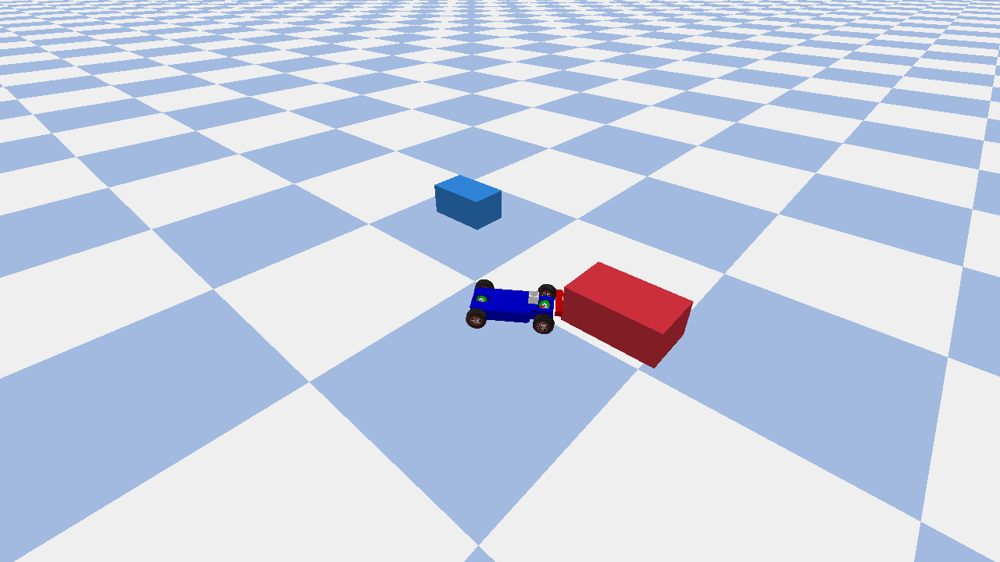
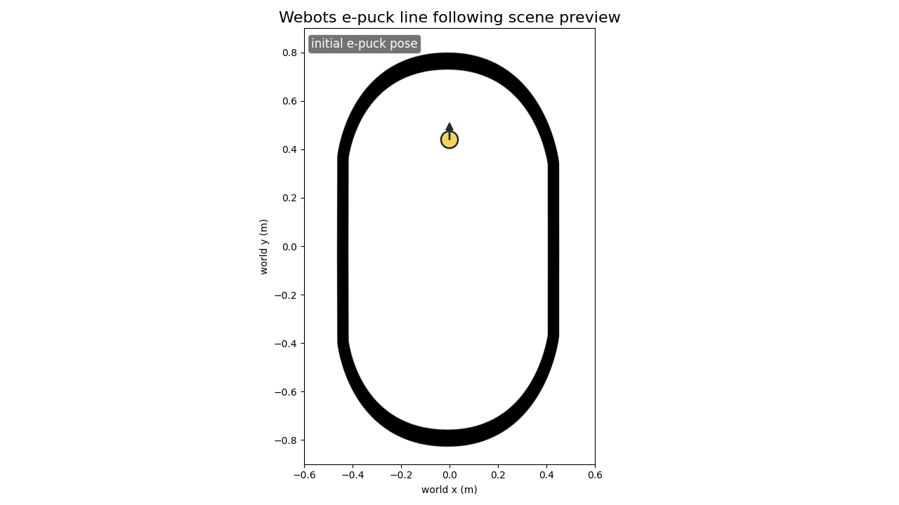
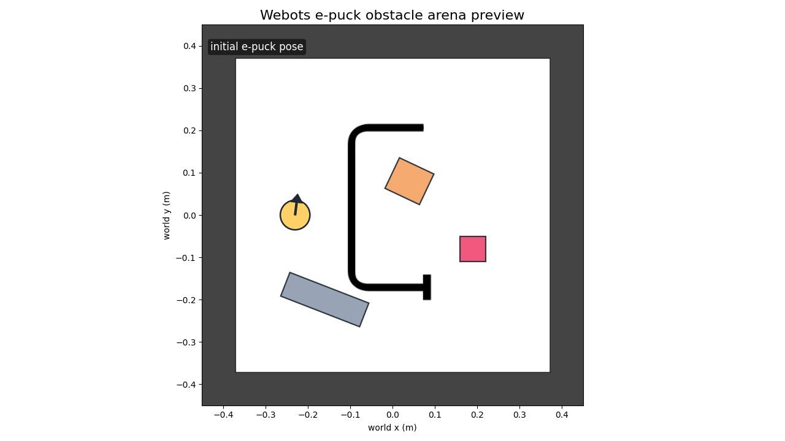

# muesli-bt

muesli-bt is a compact Lisp runtime with an integrated behaviour tree runtime for robotics and control.

It keeps behaviour logic scriptable while the [host](terminology.md#host) (backend) handles sensors, actuators, timing, and platform integration.

## start here

- [Getting oriented](getting-oriented/what-is-muesli-bt.md)
- [Getting started](getting-started.md)
- [runtime contract v1](contracts/runtime-contract-v1.md)
- [conformance levels (L0/L1/L2)](contracts/conformance.md)
- [roadmap to 1.0](roadmap-to-1.0.md)
- [Examples overview](examples/index.md)
- [Terminology](terminology.md)

## tool builders (studio and inspector consumers)

If you are building tooling around runtime data, start with:

- [muesli-studio integration contract](contracts/muesli-studio-integration.md)
- [canonical event schema (`mbt.evt.v1`)](https://github.com/unswei/muesli-bt/blob/main/schemas/event_log/v1/mbt.evt.v1.schema.json)
- [deterministic fixtures](https://github.com/unswei/muesli-bt/tree/main/tests/fixtures/mbt.evt.v1)
- [deterministic mode contract requirement](contracts/muesli-studio-integration.md#requirement-9-deterministic-mode-for-fixtures)

## conformance quick run

```bash
cmake --preset dev
cmake --build --preset dev -j
ctest --preset dev -R muesli_bt_conformance_tests --output-on-failure
python3 tools/validate_log.py --schema schemas/event_log/v1/mbt.evt.v1.schema.json tests/fixtures/mbt.evt.v1/*.jsonl
```

## demos

| PyBullet racecar | Webots e-puck line | Webots e-puck obstacle |
| --- | --- | --- |
| [](examples/pybullet-racecar.md) | [](examples/webots-epuck-line-following.md) | [](examples/webots-epuck-obstacle-wall-following.md) |

Scene previews and runtime snapshots are included on each demo page, with exact run commands and log inspection steps.

## core docs

- [Language](language/syntax.md)
- [Behaviour trees](bt/intro.md)
- [Planning](planning/overview.md)
- [Integration](integration/overview.md)
- [Observability](observability/logging.md)

## what muesli-bt is good at

- Lisp-first task logic with explicit BT execution semantics
- bounded-time planning during ticks (`planner.plan`, `plan-action`)
- backend-agnostic environment API (`env.*`)
- reproducible logs/traces for debugging and evaluation
