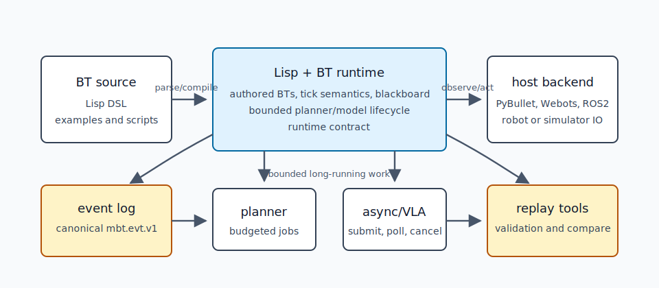

# muesli-bt documentation

## what muesli-bt is

`muesli-bt` is a compact Lisp-authored Behaviour Tree runtime for robotics. It combines task-level BT execution, bounded-time planning, cancellable asynchronous jobs, and canonical event logs in one runtime contract.

It is for task-level decision logic. It is not a hard real-time servo controller, robot driver stack, or replacement for ROS2, Nav2, or MoveIt.

## the core idea

Lisp source defines inspectable BT task logic. Host backends provide robot or simulator IO. Long-running planner and model work is submitted, polled, cancelled, and logged through the runtime contract. Canonical `mbt.evt.v1` traces support validation, replay, and evidence review.

## what makes it different

- Lisp-authored Behaviour Trees with explicit tick semantics.
- Bounded-time planning inside ticks.
- Cancellable async/VLA jobs.
- Canonical event logs and replay/conformance tooling.

## choose your path

- [I just want to run it](getting-oriented/choose-your-path.md#i-just-want-to-run-it)
- [I know Behaviour Trees and want the semantics](getting-oriented/choose-your-path.md#i-know-behaviour-trees-and-want-the-semantics)
- [I want to connect a robot or simulator](getting-oriented/choose-your-path.md#i-want-to-connect-a-robot-or-simulator)
- [I care about publication evidence](getting-oriented/choose-your-path.md#i-care-about-publication-evidence)
- [I want model or VLA integration](getting-oriented/choose-your-path.md#i-want-model-or-vla-integration)

## first runnable path

Start with [first 10 minutes](getting-started-10min.md). It builds the runtime, runs the smallest BT, and validates a canonical event log.

If you want the longer setup page, use [getting started](getting-started.md).

## current maturity

| Area | Status | Where to start |
| --- | --- | --- |
| Core Lisp runtime | released | [language syntax](language/syntax.md) |
| Behaviour Trees | released | [BT introduction](bt/intro.md) |
| Bounded planning | released | [planning overview](planning/overview.md) |
| Canonical event logs | released | [event log](observability/event-log.md) |
| Conformance L0/L1/L2 | released and CI-backed where applicable | [conformance levels](contracts/conformance.md) |
| PyBullet/Webots examples | released examples | [examples overview](examples/index.md) |
| ROS2 thin transport | released baseline, Humble-focused | [ROS2 tutorial](integration/ros2-tutorial.md) |
| Host capability bundles | contract-only / emerging | [host capability bundles](integration/host-capability-bundles.md) |
| VLA backends | released hooks and stubs unless a real backend is documented | [VLA integration](bt/vla-integration.md) |
| Nav2/MoveIt adapters | planned unless listed in release notes | [roadmap to 1.0](roadmap-to-1.0.md) |

## evidence and conformance

- [runtime contract v1](contracts/runtime-contract-v1.md)
- [canonical event log](observability/event-log.md)
- [conformance levels](contracts/conformance.md)
- [evidence index](evidence/index.md)
- [runtime performance](internals/runtime-performance.md)
- [benchmark harness](https://github.com/unswei/muesli-bt/blob/main/bench/README.md)

## roadmap

- [known limitations](known-limitations.md)
- [roadmap to 1.0](roadmap-to-1.0.md)
- [release notes](releases/index.md)
