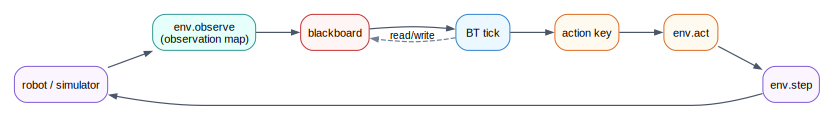

# Integration Overview

This chapter explains how muesli-bt connects to simulators and robots.

muesli-bt logic runs inside a [host](../terminology.md#host) (backend). The backend provides `env.*` operations and bridges platform-specific sensor/actuator APIs into stable schemas.

## Common Integration Approaches

1. Simulator backend
: Webots, PyBullet, or another simulator implements `env.observe`, `env.act`, `env.step`.

2. ROS2 backend
: backend maps ROS2 topics/actions/services into `env.*` and BT callbacks.

3. Direct hardware backend
: backend talks directly to drivers/SDKs without ROS.

## End-To-End Data Flow

This flow is the same whether execution is simulated time or physical robot time.

## Key Responsibilities Split

- BT/Lisp layer: decision logic and arbitration
- backend layer: sensing, actuation, timing, safety fallback, schema validation

## See Also

- [Environment API (`env.*`)](env-api.md)
- [Writing A Backend](writing-a-backend.md)
- [Sensing And Blackboard](sensing-and-blackboard.md)
- [How Execution Works](../getting-oriented/how-execution-works.md)
