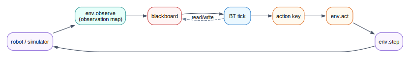

# integration overview

This chapter explains how muesli-bt connects to simulators and robots.

muesli-bt logic runs inside a [host](../terminology.md#host) (backend). The backend provides `env.*` operations and bridges platform-specific sensor/actuator APIs into stable schemas.

This page serves two different readers:

- readers who want to use an existing backend and get to a runnable system quickly
- readers who want to write or extend a backend themselves

Choose the path that matches your job, because the detailed pages are not all aimed at the same stage.

## Start Here If You Want To Use An Existing Backend

Read these first:

- [How Execution Works](../getting-oriented/how-execution-works.md)
- [Environment API (`env.*`)](env-api.md)
- [Sensing And Blackboard](sensing-and-blackboard.md)

Then move to a concrete integration:

- [ROS2 tutorial](ros2-tutorial.md) for the supported ROS2 path
- simulator example pages under [Examples Overview](../examples/index.md) if you want to start from a simulator-backed workflow

## Start Here If You Want To Write A Backend

Read these first:

- [Environment API (`env.*`)](env-api.md)
- [Sensing And Blackboard](sensing-and-blackboard.md)
- [Writing A Backend](writing-a-backend.md)
- [Host Capability Bundles](host-capability-bundles.md)

That path is for readers implementing `env.observe`, `env.act`, timing, and the platform boundary itself.
If you only want to run the existing examples, you usually do not need backend-writing material first.

## Common Integration Approaches

1. Simulator backend: Webots, PyBullet, or another simulator implements `env.observe`, `env.act`, `env.step`.
2. ROS2 backend: backend maps ROS2 transport into `env.*` while keeping BT/runtime semantics in `muesli-bt`. Start with the [ROS2 tutorial](ros2-tutorial.md), then use [ROS2 backend scope](ros2-backend-scope.md) for the detailed plan and contract surface.
3. Direct hardware backend: backend talks directly to drivers/SDKs without ROS.
4. Host capability bundle: host exposes a higher-level service such as manipulation, navigation, or perception through its own stable contract instead of widening `env.*` or `planner.plan`.

## End-To-End Data Flow

This flow is the same whether execution is simulated time or physical robot time.

## Key Responsibilities Split

- BT/Lisp layer: decision logic and arbitration
- backend layer: sensing, actuation, timing, safety fallback, schema validation

## See Also

- [Environment API (`env.*`)](env-api.md)
- [Host Capability Bundles](host-capability-bundles.md)
- [ROS2 tutorial](ros2-tutorial.md)
- [Writing A Backend](writing-a-backend.md)
- [ROS2 Backend Scope](ros2-backend-scope.md)
- [Sensing And Blackboard](sensing-and-blackboard.md)
- [How Execution Works](../getting-oriented/how-execution-works.md)
