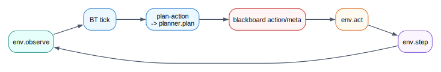

# Planning Overview

Planning in muesli-bt means computing an action under a bounded budget during a BT tick.

Planning runs inside the [host](../terminology.md#host) (backend) planner service and is exposed to Lisp through `planner.plan`. In BTs, `plan-action` is the planner leaf wrapper.

## When Planning Happens

Planning is tick-driven:

- BT tick enters a branch with `plan-action`
- `plan-action` builds a `planner.request.v1`
- planner backend (`mcts`, `mppi`, `ilqr`) runs with `budget_ms` and `work_max`
- selected action is written to blackboard

## Execution Flow

## Where Results Go

- `result.action` is written to configured action key
- `result.stats`/`result.trace` can be written to a meta key
- backend applies action through `env.act`

If planner status is non-`ok`, BT fallback logic (or backend fallback action) should safely handle the tick.

## Budgets And Deadlines

- primary time budget: `budget_ms`
- secondary cap: `work_max` (iterations/samples/optimiser iters)
- backend should still enforce safe action on overruns/failures

## See Also

- [planner.plan Request/Result](planner-plan.md)
- [PlanAction Node](plan-action-node.md)
- [MCTS](mcts.md)
- [MPPI](mppi.md)
- [iLQR](ilqr.md)
- [Planner Logging Schema](../observability/planner-logging.md)
