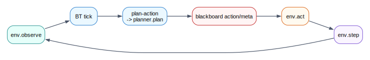

# Planning Overview

Planning in muesli-bt means computing an action under a bounded budget during a BT tick.

Planning runs inside the [host](../terminology.md#host) (backend) planner service and is exposed to Lisp through `planner.plan`. In BTs, `plan-action` is the planner leaf wrapper.

Read this page when you already understand basic BT ticking and want the smallest mental model for planning inside a tree.
For most readers, the first useful goal is not planner internals. It is understanding what state must already exist, what key receives the planned action, and why the tree keeps ticking after planning.

## When Planning Happens

Planning is tick-driven:

- BT tick enters a branch with `plan-action`
- `plan-action` builds a `planner.request.v1`
- planner backend (`mcts`, `mppi`, `ilqr`) runs with `budget_ms` and `work_max`
- selected action is written to blackboard

## Execution Flow



## Where Results Go

- `result.action` is written to configured action key
- `result.stats`/`result.trace` can be written to a meta key
- backend applies action through `env.act`

If planner status is non-`ok`, BT fallback logic (or backend fallback action) should safely handle the tick.

## Minimum Runnable Planning Loop

The minimum pattern is:

1. seed the blackboard with the current state
2. tick a tree containing `plan-action`
3. read the planned action from the configured action key
4. apply that action to the world or state
5. tick again with the updated state

From the checked-in `planner-bt-1d.lisp` example, the minimum keys to notice are:

- `state`: the current planning state consumed by `plan-action`
- `action`: the key where the planner writes the selected action
- `seed`: an optional deterministic seed key used by the example
- `plan-meta`: optional planner metadata for inspection

Small runnable shape:

```lisp
(defbt one-d-control
  (sel
    (cond goal-reached-1d state 1.0 0.05)
    (seq
      (plan-action
        :name "one-d-planner"
        :planner "mcts"
        :budget_ms 8
        :work_max 800
        :model_service "toy-1d"
        :state_key state
        :action_key action)
      (act apply-planned-1d state action state)
      (running))))

(define inst (bt.new-instance one-d-control))
(bt.tick inst '((state 0.0) (seed 42)))
(bt.tick inst)
```

What to notice:

- `plan-action` does not apply the action itself; it writes the chosen action into `action`
- `apply-planned-1d` is the host action callback that consumes `action` and updates `state`
- the example keeps ticking because planning and state application happen as part of a repeated control loop, not a one-shot solve

> Maintainer note: checked-in examples currently use string planner identifiers such as `"mcts"`, while some planning prose documents keyword forms such as `:mcts`. This page keeps the checked-in example form and should be reconciled with the reference docs once the recommended copy-paste form is confirmed.

## Budgets And Deadlines

- primary time budget: `budget_ms`
- secondary cap: `work_max` (iterations/samples/optimiser iters)
- backend should still enforce safe action on overruns/failures

## See Also

- [planner.plan Request/Result](planner-plan.md)
- [PlanAction Node](plan-action-node.md)
- [How Execution Works](../getting-oriented/how-execution-works.md)
- [MCTS](mcts.md)
- [MPPI](mppi.md)
- [iLQR](ilqr.md)
- [Planner Logging Schema](../observability/planner-logging.md)
